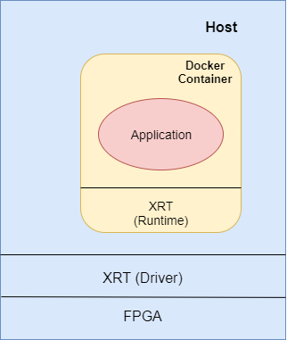
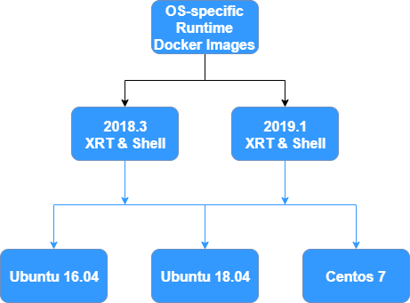
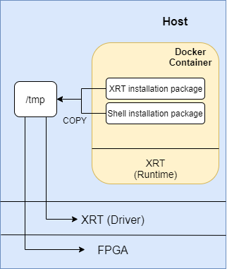

# Xilinx Runtime Base Image Deployment Docker Solution

This project maintains unified Docker images with XRT (Xilinx runtime) preinstalled and provides scripts to setup and flash the Alveo cards.

With content found on this repo, the user can:

* [Setup Host (install driver and flash the cards)](#setup-host)
* [Run Base Docker Image](#run-base-docker-image)
* [Customize Docker Image for new Application](#build-docker-application-by-using-base-image)

## Background

Docker is a set of platform-as-a-service (PaaS) products that use OS-level virtualization to deliver Xilinx_Base_Runtimed containers. Containers allow a developer to package up an application with all of the parts it needs, such as libraries and other dependencies, and ship it all out as one package. For more docker information, please refer [Docker Documentation](https://docs.docker.com). 



For running docker containers of FPGA applications, there are several preconditions:
1. Install Xilinx Alveo FPGA hardware (Alveo U200, Alveo U250 or Alveo U280) on server.
2. Install XRT (Xilinx Runtime) on host (script provided in this repo).
3. Flash Shell for FPGA on host  (also included in script in this repo).
4. Run docker FPGA container with privileged mode or mapping both management device and user device\*.
> By default, Docker containers are “unprivileged” and cannot, for example, run a Docker daemon inside a Docker container. This is because by default a container is not allowed to access any devices, but a “privileged” container is given access to all devices (see the documentation on cgroups devices). If you want to limit access to a specific device or devices you can use the `--device` flag. It allows you to specify one or more devices that will be accessible within the container. For Xilinx Alveo FPGA, it has management function and user function. Docker will take these two functions as two devices for mapping. 

## Available Docker Images


Docker Images | Platform | Version | OS Version
------------- | -------- | ------- | ----------
alveo-2018.3-centos      | Alveo U200 / U250 | 2018.3 | CentOS
alveo-2018.3-ubuntu-16.04 | Alveo U200 / U250 | 2018.3 | Ubuntu 16.04
alveo-2018.3-ubuntu-18.04 | Alveo U200 / U250 | 2018.3 | Ubuntu 18.04
alveo-2019.1-centos      | Alveo U200 / U250 / U280 | 2019.1 | CentOS
alveo-2019.1-ubuntu-16.04 | Alveo U200 / U250 / U280 | 2019.1 | Ubuntu 16.04
alveo-2019.1-ubuntu-18.04 | Alveo U200 / U250 / U280 | 2019.1 | Ubuntu 18.04
alveo-2019.2-centos      | Alveo U200 / U250 / U280 / U50| 2019.2 | CentOS
alveo-2019.2-ubuntu-16.04 | Alveo U200 / U250 / U280 / U50 | 2019.2 | Ubuntu 16.04
alveo-2019.2-ubuntu-18.04 | Alveo U200 / U250 / U280 / U50 | 2019.2 | Ubuntu 18.04
alveo-2020.1-centos      | Alveo U200 / U250 / U280 / U50| 2020.1 | CentOS
alveo-2020.1-ubuntu-16.04 | Alveo U200 / U250 / U280 / U50 | 2020.1 | Ubuntu 16.04
alveo-2020.1-ubuntu-18.04 | Alveo U200 / U250 / U280 / U50 | 2020.1 | Ubuntu 18.04

## Setup Host

In order to install XRT and the platform on the host machine and flash the card, a single command (see host_setup.sh) with two parameters (platform and version) is provided.

The figure below shows how installing XRT and platform is done. With the specified platform and version, the project copies corresponding XRT and platform installation packages from each card product page (U200, U250, U280):

* [Alveo U200](https://www.xilinx.com/products/boards-and-kits/alveo/u200.html#gettingStarted)
* [Alveo U250](https://www.xilinx.com/products/boards-and-kits/alveo/u250.html#gettingStarted)
* [Alveo U280](https://www.xilinx.com/products/boards-and-kits/alveo/u280.html#gettingStarted)




### Installation Example
1. Run host_setup.sh as root. 

2. Clone repository from Xilinx GitHub
```
root@machine:~$ git clone https://github.com/Xilinx/Xilinx_Base_Runtime.git
```

3. Go to Xilinx_Base_Runtime directory
```
root@machine:~$ cd Xilinx_Base_Runtime
```

4. According to demand, choose deployment shell base on version.
```
#  ./host_setup.sh     --version <version>
#  ./host_setup.sh      -v       <version>
#  <version>      : 2018.3 / 2019.1 / 2019.2 / 2020.1
root@machine:~$ ./host_setup.sh -v 2019.1 
```

5. Wait until installation completed. During the period you may need press [Y] to continue. Please Note: If you choose flashing FPGA, you need to cold reboot local machine after installation completed to load the new image on FPGA.


## Run Base Docker Image

Docker is a set of platform-as-a-service (PaaS) products that use OS-level virtualization to deliver Xilinx_Base_Runtimed containers. Inside container, you can have an isolated runtime environment with pre-installed XRT(Xilinx Runtime) and dependencies. 
> However, the container cannot access host kernel. Therefore you need install same version XRT on host as driver and use XRT inside container as runtime. And the FPGA should be flashed with specified Shell. You can find all installation packages from [Xilinx Product Page](https://www.xilinx.com/products/boards-and-kits/alveo.html) or installing with this project. See [**Setup Host**](#setup-host). 


### Runtime Example
1. Clone repository from Xilinx GitHub
```
user@machine:~$ git clone https://github.com/Xilinx/Xilinx_Base_Runtime.git
```
2. Go to Xilinx_Base_Runtime directory
```
user@machine:~$ cd Xilinx_Base_Runtime
```

3. Run run.sh with corresponding arguments: xrt version and os version
```
#  ./run.sh     --version <version> --os-version <os-version>
#  ./run.sh      -v       <version>  -o          <os-version>
#  <version>      : 2018.3 / 2019.1 / 2019.2 /2020.1
#  <os-version>   : ubuntu-18.04 / ubuntu-16.04 / centos
user@machine:~/Xilinx_Base_Runtime$ ./run.sh -v 2019.1 -o ubuntu-18.04
```

4. Inside docker container, run `xbutil list` or `xbutil dmatest` for listing cards or testing dma. Or copy your own application and xclbin files to container and run for test. 
```
root@fc33db3f6ed6:/$ /opt/xilinx/xrt/bin/xbutil list

root@fc33db3f6ed6:/$ /opt/xilinx/xrt/bin/xbutil dmatest
```


## Build docker application by using base image
All the docker images provided by this project can be used as base images for building your own docker applications because they all have XRT and dependencies installed. Here is an simple example of Dockerfile.

```
# Choose one of images as base image based on platform, version and OS version
FROM xilinx/xilinx_runtime_base:alveo-2019.2-ubuntu-18.04

# Configure environment what your application needs, for example
apt-get install [dependencies]

# Copy your application and xclbin files
COPY [application_file] [path_of_application_file]
COPY [xclbin_file] [path_of_xclbin_file]
```

Then you can use `docker build -t [tag] -f [Dockerfile]` to build your own docker application. 

## FAQ
1. Why should I install XRT on host if XRT is already installed inside container?
> XRT contains multiple things: driver, runtime, utilities and etc. Docker container cannot access host kernel directly. Therefore, XRT inside container is runtime, and XRT on host talks to kernel as driver. 
> For now, XRT does NOT support backward. You need make sure the versions of both host XRT and container XRT should be same. 

2. I don't want to run docker in privileged mode. How can I map management function and user function as devices to docker container?
> You can use docker run `--device` flag. The path of management function is `/dev/xclmgm[num_mgmt]` and the path of user function is `/dev/dri/renderD[num_user]`. 
> For `num_mgmt`, run `/opt/xilinx/xrt/bin/xbmgmt scan`, you will see something like:
> `[0]mgmt:[03:00.1]:0x5000:0x000e:[xclmgmt:2.2.2173,ff6624c6d72c6ca68d6b123c9d76e49e55c09097:769]`
> The first number `[0]` is the index of FPGA(you may have multiple cards installed), and the last number `:769` is `num_mgmt`
> For `num_user`, run `/opt/xilinx/xrt/bin/xbutil scan`, you will see something like:
> `[0]user:[30:00.0]:0x5001:0xe000:[xocl:2.2.2173,ff6624c6d72c6ca68d6b123c9d76e49e55c09097:128]`
> Please make sure the index is same as mgmt, and the last number `:128` is `num_user`
> After find out `num_mgmt` and `num_user`, you can run docker like:
> `docker run --rm -it --device=/dev/xclmgmt769:/dev/xclmgmt769 --device=/dev/dri/renderD128:/dev/dri/renderD128 xilinx/xsds:alveo-u200-2019-1-ubuntu-1604`

3. What does OS version mean for docker images?
> Docker can provide OS-level virtualization. You can run CentOS based docker container on Ubuntu server. It provides convenience for customers build their applications without considering different OS versions. 

4. If I have installed mutilple FPGA cards on host, which cards would be accessable in docker container?
> All of them. run.sh script will scan all FPGA devices and map them to docker container. If you want limit specific cards, please refer question #2. Please be aware, mapping device does NOT mean exclusive for the container. 

## Notice and Disclaimer
NOTICE: This Xilinx_Base_Runtime to you in the form of a Docker image (the “Image”).  By using this Image, you agree on behalf of yourself and your employer (if applicable) to be bound by this information and the license agreements applicable to the Xilinx_Base_Runtimede this Image and (if applicable) the Xilinx_Base_Runtimeributed inside this Image but is needed to run the Image and which is downloaded from the internet upon execution of the Docker build utility script made available to you (the “Script”).  Should you elect to execute the Script by entering the necessary commands, you acknowledge that various Xilinx_Base_Runtimed, either from the Image or from the internet, and installed in the Image, and you agree that you are solely responsible for reviewing and abiding by the terms of the license agreements governing such Xilinx_Base_Runtime Docker executable and installed into the Image.  The Xilinx_Base_Runtimets are available for your review either in the “LICENSE” file at the Image download site, or in the source code of the Xilinx_Base_Runtimehe Image, or in the case of either (i) operating system Xilinx_Base_Runtimeided to you for the main community open source project web page, and (ii) Xilinx_Base_Runtimethe internet, at the URL provided to you for the original web page where such Xilinx_Base_Runtime for download.  If you do not agree, then you should not “click” accept the notice nor enter the Script command nor otherwise access, download, install or use the Image.  

DISCLAIMER:  THIS IMAGE IS MADE AVAILABLE “AS-IS” AND XILINX DISCLAIMS ALL WARRANTIES AND CONDITIONS, EXPRESS, IMPLIED, OR STATUTORY, INCLUDING BUT NOT LIMITED TO WARRANTIES OF MERCHANTABILITY, NON-INFRINGEMENT, OR FITNESS FOR ANY PARTICULAR PURPOSE. Xilinx shall not be liable (whether in contract or tort, including negligence, or under any other theory of liability) for any loss or damage of any kind or nature related to, arising under, or in connection with, this Image, including for any direct, indirect, special, incidental, or consequential loss or damage (including loss of data, profits, goodwill, or any type of loss or damage suffered as a result of any action brought by a third party) even if such damage or loss was reasonably foreseeable or Xilinx had been advised of the possibility of the same.