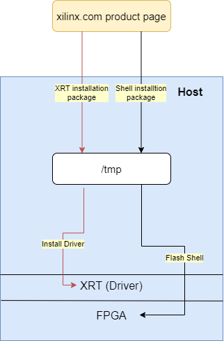

# Software and SHELL deployment docker solution

This project provides unified docker images for several purposes: 

* [Setup Host](#setup-host)
* [Isolated Runtime Enviorment](#isolated-runtime-enviorment)
* [As base image for docker application](#base-docker-images)

## Background

Docker is a set of platform-as-a-service (PaaS) products that use OS-level virtualization to deliver software in packages called containers. Containers allow a developer to package up an application with all of the parts it needs, such as libraries and other dependencies, and ship it all out as one package. For more docker information, please refer [Docker Documentation](https://docs.docker.com). 


For running docker containers of FPGA applications, there are several preconditions:
1. Install Xilinx Alveo FPGA hardwares(Alveo U200, Alveo U250 or Alveo U280) on server.
2. Install XRT(Xilinx Runtime) on host.
3. Flash Shell for FPGA on host.
4. Run docker FPGA container with privileged mode or mapping both management device and user device\*.
> By default, Docker containers are “unprivileged” and cannot, for example, run a Docker daemon inside a Docker container. This is because by default a container is not allowed to access any devices, but a “privileged” container is given access to all devices (see the documentation on cgroups devices).If you want to limit access to a specific device or devices you can use the `--device` flag. It allows you to specify one or more devices that will be accessible within the container. For Xilinx Alveo FPGA, it has management function and user function. Docker will take these two functions as two devices for mapping. 

## Available Docker Images


Docker Images | Platform | Version | OS Version
------------- | -------- | ------- | ----------
alveo-2018-3-centos      | Alveo U200 / U250 | 2018.3 | CentOS
alveo-2018-3-ubuntu-1604 | Alveo U200 / U250 | 2018.3 | Ubuntu 16.04
alveo-2018-3-ubuntu-1804 | Alveo U200 / U250 | 2018.3 | Ubuntu 18.04
alveo-2019-1-centos      | Alveo U200 / U250 / U280 | 2019.1 | CentOS
alveo-2019-1-ubuntu-1604 | Alveo U200 / U250 / U280 | 2019.1 | Ubuntu 16.04
alveo-2019-1-ubuntu-1804 | Alveo U200 / U250 / U280 | 2019.1 | Ubuntu 18.04

## Setup Host

This project will help to install XRT and Shell on the host machine with the above unified docker images. A single command (install.sh) with two parameters: platform and version can be used to install the XRT, Shell as well as Flash the card.

The figure shows how installing XRT and Shell is been done. With the specified platform and version, the project copies correspoding XRT and Shell installation packages from [Xilinx lounge page](https://www.xilinx.com/products/boards-and-kits/alveo.html). Then it installs XRT and Shell and flashes the card automatically.  



### Installation Example
1. Deployment script must be run as root

2. Clone repository from Xilinx GitHub
```
root@machine:~$ git clone https://github.com/Xilinx/software_shell_deployment.git
```

3. Go to software_shell_deployment directory
```
root@machine:~$ cd software_shell_deployment
```

4. According to demand, choose deployment shell with corresponding parameters: platform and version.
```
#  ./install.sh     --install-xrt --install-shell --platform <platform> --version <version> --os-version <os-version>
#  ./install.sh     -x              -s             -p        <platform>  -v       <version>  -o          <os-version>
#  <platform>     : alveo-u200 / alveo-u250 / alveo-u280
#  <version>      : 2018.3 / 2019.1
#  <os-version>   : ubuntu-18.04 / ubuntu-16.04 / centos
root@machine:~$ ./deploy_xrt_shell.sh -p alveo-u200 -v 2019.1 -o ubuntu-18.04
```

5. Wait until installation completed. During the period you may need press [Y] to continue. Please Note: If you choose flashing FPGA, you need to cold reboot local machine to load the new image on FPGA.


## Isolated Runtime Enviorment

Docker is a set of platform-as-a-service (PaaS) products that use OS-level virtualization to deliver software in packages called containers. Inside container, you can have an isolated runtime enviorment with pre-installed XRT(Xilinx Runtime) and dependencies. 
> However, the container cannot access host kernel. Therefore you need install same version XRT on host as driver and use XRT inside container as runtime. And the FPGA should be flashed with specified Shell. You can find all installation packages from [Xilinx Product Page](https://www.xilinx.com/products/boards-and-kits/alveo.html) or installing with this project. See [**Setup Host**](#setup-host). 


### Runtime Example
1. Clone repository from Xilinx GitHub
```
user@machine:~$ git clone https://github.com/Xilinx/software_shell_deployment.git
```
2. Go to software_shell_deployment directory
```
user@machine:~$ cd software_shell_deployment
```

3. Run run.sh with corresponding arguments: platform, xrt version and os version
```
#  ./run.sh     --platform <platform> --version <version> --os-version <os-version>
#  ./run.sh      -p        <platform>  -v       <version>  -o          <os-version>
#  <platform>     : alveo-u200 / alveo-u250 / alveo-u280
#  <version>      : 2018.3 / 2019.1
#  <os-version>   : ubuntu-18.04 / ubuntu-16.04 / centos
user@machine:~/software_shell_deployment$ ./run.sh -p alveo-u200 -v 2019.1 -o ubuntu-18.04
```

4. Inside docker container, run `list` or `dmatest` with `xbutil` for listing cards or testing dma. Or copy your own application and xclbin files to container and run for test. 
```
root@fc33db3f6ed6:/$ /opt/xilinx/xrt/bin/xbutil list

root@fc33db3f6ed6:/$ /opt/xilinx/xrt/bin/xbutil dmatest
```


## Base Docker Images
All the docker images provided by this project can be used as base images for building your own docker applications because they all have XRT and dependencies installed. Here is an simple example of Dockerfile.

```
# Choose one of images as base image based on platform, version and OS version
FROM xilinx/xsds:alveo-u280-2019-1-ubuntu-1804

# Configure enviroment what your application needs, for example
apt-get install [dependencies]

# Copy your application and xclbin files
COPY [application_file] [path_of_application_file]
COPY [xclbin_file] [path_of_xclbin_file]
```

Then you can use `docker build -f [Dockerfile]` to build your own docker application. 

## FAQ
1. Why shuold I install XRT on host if XRT is already installed inside container?
> XRT contains multiple things: driver, runtime, utilities and etc. Docker container cannot access host kernel directely. Therefore, XRT inside container is runtime, and XRT on host talks to kernel as driver. 
> For now, XRT does NOT support backward. You need make sure the versions of both host XRT and contanier XRT should be same. 

2. I don't want to run docker in privileged mode. How can I map management function and user function as devices?
> You can use docker run `--device` flag. The path of management function is `/dev/xclmgm[num_mgmt]` and the path of user function is `/dev/dri/renderD[num_user]`. 
> For `num_mgmt`, run `/opt/xilinx/xrt/bin/xbmgmt scan`, you will see something like:
> `[0]mgmt:[03:00.1]:0x5000:0x000e:[xclmgmt:2.2.2173,ff6624c6d72c6ca68d6b123c9d76e49e55c09097:769]`
> The first number `[0]` is the index of FPGA(you may have multiple cards installed), and the last number `:769` is `num_mgmt`
> For `num_user`, run `/opt/xilinx/xrt/bin/xbutil scan`, you will see something like:
> `[0]user:[30:00.0]:0x5001:0xe000:[xocl:2.2.2173,ff6624c6d72c6ca68d6b123c9d76e49e55c09097:128]`
> Please make sure the index is same as mgmt, and the last number `:128` is `num_user`
> After find out `num_mgmt` and `num_user`, you can run docker like:
> `docker run --rm -it --device=/dev/xclmgmt769:/dev/xclmgmt769 --device=/dev/dri/renderD128:/dev/dri/renderD128 xilinx/xsds:alveo-u200-2019-1-ubuntu-1604`

3. What does OS version mean for docker images?
> Docker can provide OS-level virtualization. You can run CentOS based docker container on Ubuntu server. It provides convience for customers build their applications without considering different OS versions. 

